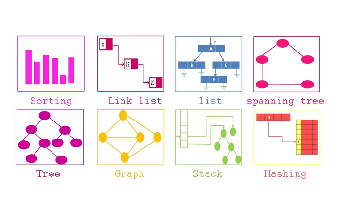

# Personal portfolio for Data Structure 
A data structure is a way of organizing and storing data in a computer program so that it can be efficiently accessed and manipulated. Data structures are designed to optimize the use of computer memory and processing power, and to enable the performance of operations on the data, such as searching, sorting, and retrieving.

There are many types of data structures, each with its own advantages and disadvantages. Some examples of common data structures include arrays, linked lists, stacks, queues, trees, and graphs. The choice of data structure to use depends on the specific needs of the program, including the type of data being stored, the frequency and type of operations being performed on the data, and the available resources of the system on which the program is running.
## I also will be adding different data structure for various languages

- Python folder includes homework related stuff and personal data structures
- JavaScript folder includes personal data structures for practice
- Java folder includes personal data structures for java practice
- Algorithms folder includes different sorting methods for multiple languages
- Cpp folder includes data structures in C++
- Planning adding C# folder later, once I get more free time